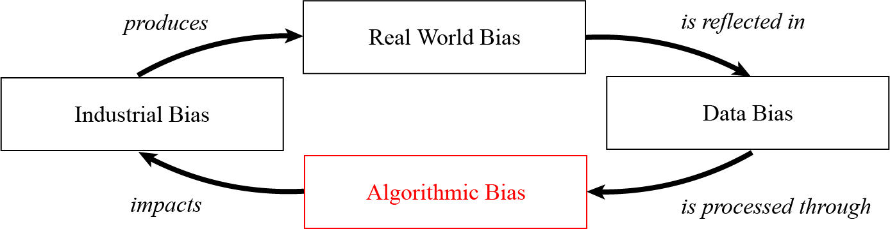

## Evaluation of algorithmic leave one out unfairness of state-of-the-art machine learning and deep learning models

In this work, a parallelized system to quantify algorithmic Leave-one-out unfairness of FFNN and Logistic Regression is implemented, which can also be applied to any other classifiers.
